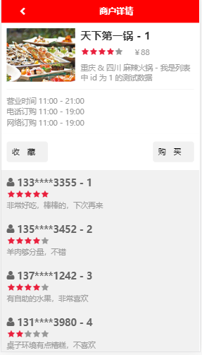
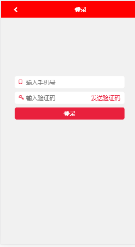
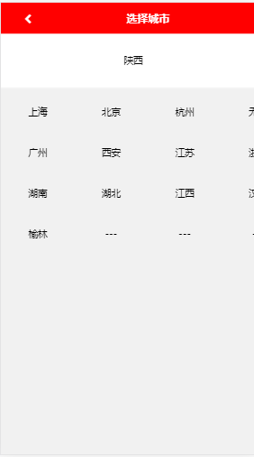

# react 高级实战练习

## 技术栈

+ webpack 4.42.1
+ fetch 1.1.0
+ react 16.13.1
+ react-dom 16.13.1
+ react-redux 7.2.0
+ react-router-dom 5.1.2
+ react-swipe 5.1.1
+ redux 4.0.5

等,均为当前(2020 年 3 月)最新(最新版本存在 bug 的除外)

+ 90% 的组件使用 react Hook 实现

## 其它说明

+ webpack 等工程化相关环境根据项目从零搭建的，基本满足项目需求,但未经过完善还有一些存在问题的地方,如配置文件拆等

+ koa2 模拟后台接口,接口均为测试,未连接数据库,接口操作部分与正常接口相同，可正常获取前端参数也简单处理返回数据给前端

## 项目背景

因为一些原因很长一段时间在家,为了更好的深入理解 redux 和 react hook 的使用仅依托于[慕课网](https://www.imooc.com/) [双越老师](https://www.imooc.com/t/4427201)的实战课程[React技术栈仿大众点评Web App](https://coding.imooc.com/class/99.html)的业务逻辑,使用当前(2020-03)最新从零搭建开发环境、使用 React hook 实现组件开发


## 文件夹结构说明

### docs 文件夹

`开发过程中的一些记录、总结`

### code 

`项目源代码` project 分支为完整代码,其余分支为辅助开发分支

## 运行项目

```shell
# run test api

cd server
yarn install
yarn dev

# run web code
cd code
yarn install
yarn start

```

## 运行效果预览









